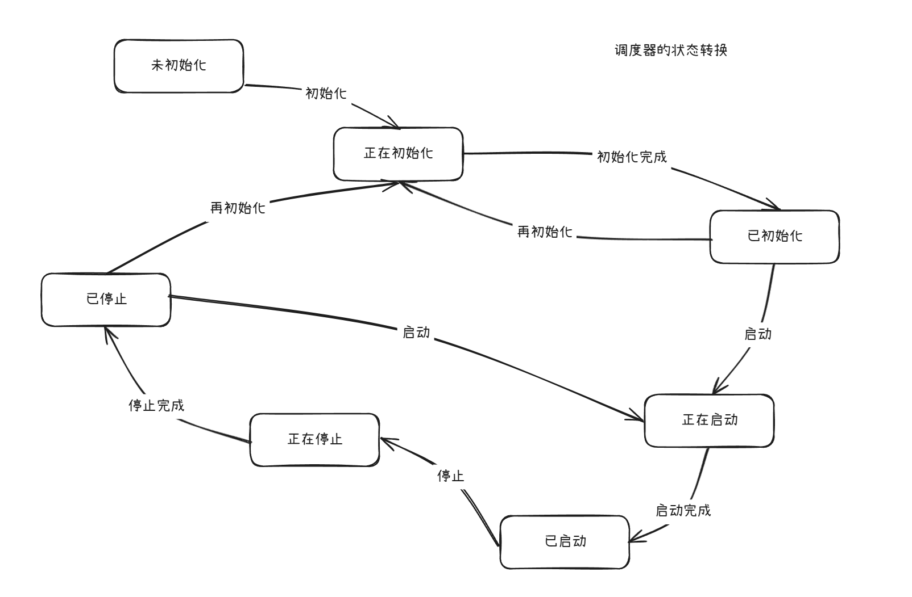
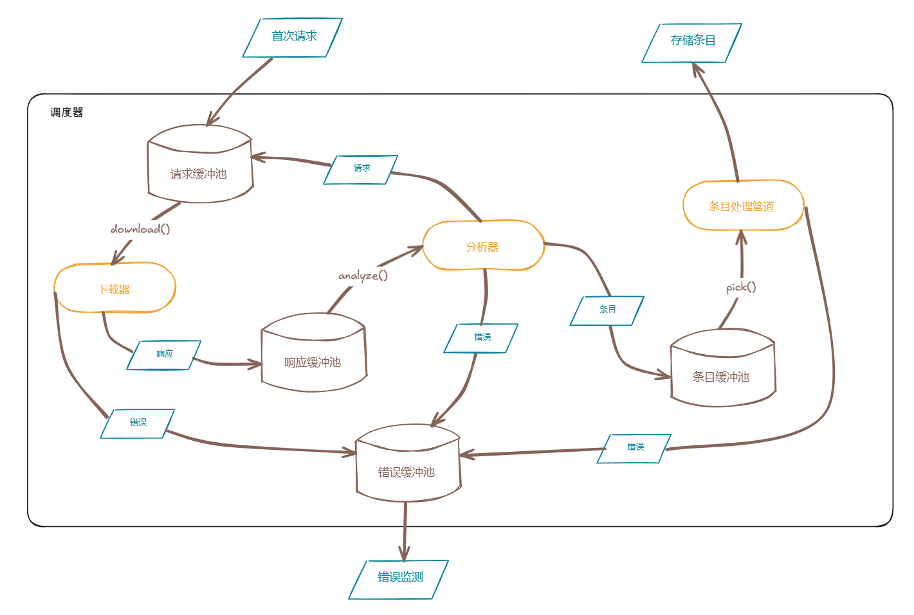

# webcrawler
High-Concurrency Web Crawler Framework

# 项目结构介绍
~~~
webcrawler/
├── helper/
│   └── errors/
│       └── errors.go   // 实现error接口，用于生成调度器、下载器、分析器和条目处理器对应错误信息。
├── module/
│   ├── local/
│   │   ├── analyzer/           // 分析器的具体实现。
│   │   │   ├── analyzer.go
│   │   │   └── errors.go
│   │   ├── download/           // 下载器的具体实现。
│   │   │   ├── download.go
│   │   │   └── errors.go
│   │   └── pipeline/           // 条目处理管道的具体实现。
│   │       ├── errors.go
│   │       └── pipeline.go
│   │
│   ├── stub/
│   │     ├── base.go           // 组件内部接口定义，扩展了组件通用接口。
│   │     └── stub.go           // 内部接口实现。
│   ├── base.go                 // 定义组件通用接口、定义下载器、分析器、条目处理管道接口，三者应实现组件接口。
│   ├── data.go                 // Req、Rsp和Item数据定义，实现Data接口。
│   ├── errors.go
│   ├── module_id.go
│   ├── module_type.go
│   ├── registrar.go           // 注册器的具体实现，调度器的重要组成部分。
│   ├── score.go               // 定义评分计算函数的形式，可扩展。评分机制目的为组件实例的负载均衡。
│   └── sn.go
│   │
│   ├── scheduler/             // 爬取项目的控制模块，调度器的实现。
│   │   ├── args.go            // 调度器初始化需要的三个参数定义。
│   │   ├── domain.go
│   │   ├── errors.go
│   │   ├── scheduler.go
│   │   ├── status.go          // 调度器的七状态定义，状态转换详见下图。
│   │   └── summary.go
│   └── toolkit/
│       ├── buffer/
│       │   ├── buffer.go      // 缓冲器的定义及方法实现。
│       │   ├── errors.go
├──     ├── └── pool.go        // 缓冲池的定义与方法实现，缓冲池由多个缓冲器组成。
~~~
# 调度器的状态转换

# 数据处理流程图

